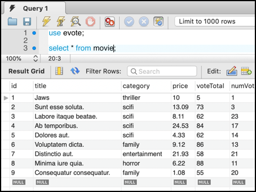

# evote-movie-2020-19-faker-test-data

We are going to refactor our project to use the Faker 3rd-party library to make it easy to generate many test data 'fixtures' with little effort.

Learn about the Faker library at Github or Packagist (same README, different formatting):

- [github](https://github.com/fzaninotto/Faker)
- [packagist](https://packagist.org/packages/fzaninotto/faker)



- add the Faker library to our project using the Composer command line tool:

    ```bash
    composer req fzaninotto/faker
  
    Using version ^1.9 for fzaninotto/faker
    ./composer.json has been updated
    Loading composer repositories with package information
    Updating dependencies (including require-dev)
    Package operations: 1 install, 0 updates, 0 removals
      - Installing fzaninotto/faker (v1.9.1): Loading from cache
    Writing lock file
    Generating autoload files
    ```

- edit file `db/migrationAndFixtures.php` to create a `$faker` object just after we create our `MovieRepository` object:

    ```php
    <?php
    require_once __DIR__ . '/../config/dbConstants.php';
    require_once __DIR__ . '/../vendor/autoload.php';
    
    use Tudublin\Movie;
    use Tudublin\MovieRepository;
    
    $movieRespository = new MovieRepository();
    $faker = Faker\Factory::create();
    ```
  
- remove the existing Movie objects, execpt the first one:

    ```php
    // (3) create objects & insert into DB
    $m1 = new Movie();
    $m1->setId(1);
    $m1->setTitle('Jaws');
    $m1->setCategory('thriller');
    $m1->setPrice(10.00);
    $m1->setVoteTotal(5);
    $m1->setNumVotes(1);
  
    $movieRespository->create($m1);
    ```

- we'll now create a second `Movie` object using Faker random fake data methods. First we need to create the values:

    ```php
    $id = 2;
    $title = $faker->sentence(2);
    $category = $faker->randomElement('horror', 'scifi', 'family', 'comedy', 'entertainment');
    $price = $faker->randomFloat(2, 1.00, 25.00);
    $voteTotal = $faker->numberBetween(50, 100);
    $numVotes = $faker->numberBetween(0, 25);
    ```

    - we have hard-coded the `id` - we don't want this to random, since we might overwrite an existing item
    
    - for `title` we are using Faker's `sentence(<n>)` method, returning us some random **Lipsom** Latin words
    
    - for `category` we are using Faker's `randomElement(<array>)` method, whereby a random value from an array is chosen
    
    - for `price` we are using Faker's `randomFloat(<dp>, <min>, <max>)` method - for a random decimal value in a range
    
    - for `voteTotal` and `numVotes` we are using Faker's `numberBetween(<min>,<max>)` method - for a random integer in a range

- now all we have to do is create an object, set its properties and insert it into the DB:
    
    ```php
    $id = 2;
    $title = $faker->sentence(2);
    $category = $faker->randomElement(['horror', 'scifi', 'family', 'comedy', 'entertainment']);
    $price = $faker->randomFloat(2, 1.00, 25.00);
    $voteTotal = $faker->numberBetween(50, 100);
    $numVotes = $faker->numberBetween(0, 25);
    
    $m = new Movie();
    $m->setId($id);
    $m->setTitle($title);
    $m->setCategory($category);
    $m->setPrice($price);
    $m->setNumVotes($numVotes);
    $m->setVoteTotal($voteTotal);
    
    $movieRespository->create($m);
    ```

- now when we execute our Movie migration and fixtures script we should see the `Jaws` movie and a second, random one created:

    ```bash
     php db/migrationAndFixtures.php 
    --------------- DatabaseTableRepository->createTable() ----------------
    NOTE:: Looking for a constant CREATE_TABLE_SQL defined in the entity class associated with this repository
    -----------------------------------------------------------------------
    <pre>vote-movie-2020-19-faker-test-data/db/migrationAndFixtures.php:51:
    array(2) {
      [0] =>
      class Tudublin\Movie#29 (6) {
        private $id =>
        string(1) "1"
        private $title =>
        string(4) "Jaws"
        private $category =>
        string(8) "thriller"
        private $price =>
        string(2) "10"
        private $voteTotal =>
        string(1) "5"
        private $numVotes =>
        string(1) "1"
      }
      [1] =>
      class Tudublin\Movie#30 (6) {
        private $id =>
        string(1) "2"
        private $title =>
        string(28) "Consequatur voluptate dicta."
        private $category =>
        string(5) "scifi"
        private $price =>
        string(5) "15.07"
        private $voteTotal =>
        string(2) "91"
        private $numVotes =>
        string(1) "1"
      }
    }
    ```
  
    - we can see the random Latin words for the title: "Consequatur voluptate dicta." and so on
    
- finally, rather than creating a **single** object with random values, let's write a loop to create as many of these as we wish. We'll use an array loop variable `$id` starting at 2:

    ```php
    for($id=2; $id < 10; $id++){
        $title = $faker->sentence(2);
        $category = $faker->randomElement(['horror', 'scifi', 'family', 'comedy', 'entertainment']);
        $price = $faker->randomFloat(2, 1.00, 25.00);
        $voteTotal = $faker->numberBetween(50, 100);
        $numVotes = $faker->numberBetween(0, 25);
    
        $m = new Movie();
        $m->setId($id);
        $m->setTitle($title);
        $m->setCategory($category);
        $m->setPrice($price);
        $m->setNumVotes($numVotes);
        $m->setVoteTotal($voteTotal);
    
        $movieRespository->create($m);
    }
    ```php
